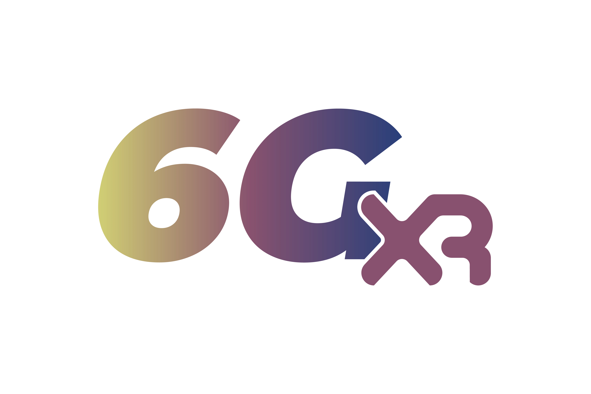
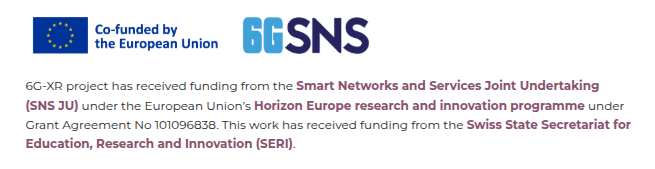
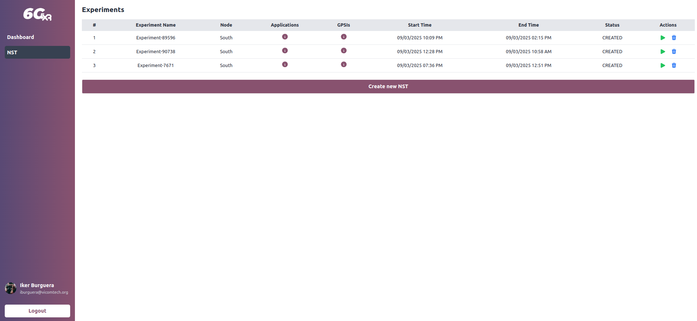
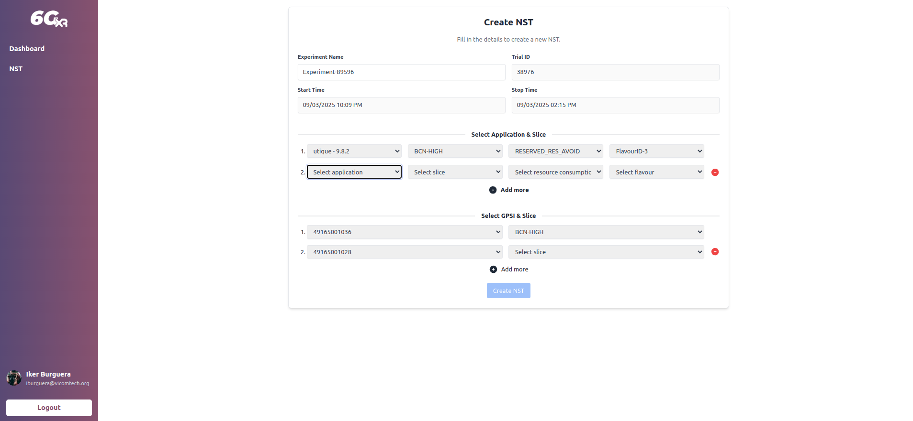

<div align="center">
 <br>
 <br>
</div>

# :busts_in_silhouette: Leading company and participants

- **Project type:** European Research Project focused on 6G technologies and XR innovations. [More info](https://6g-xr.eu/about-6g-xr/)

- **Consortium:** European consortium focusing on the development of next-generation XR services and infrastructures. [More info](https://6g-xr.eu/consortium/)

<div align="center">
 <br>
</div>

# :dart: Objective 
The project aims to develop a multisite Research Infrastructure (RI) to validate various 6G use cases, focusing on innovative XR applications, edge computing, and beyond 5G technologies. It also targets advancements in holographics, digital twins, and immersive XR/VR applications.

# 📚 Documentation
The South Web Portal is a key component of the 6G-XR Trial Controller, designed to facilitate and automate the deployment of XR-related experiments within the South Node testbed. This platform enables researchers and developers to efficiently manage network slices, monitor system performance, and integrate innovative XR enablers in Beyond 5G (B5G) and 6G environments.

# :thinking: How will it be done?
The South Web Portal is designed to streamline the deployment and management of XR-related experiments in the South Node testbed. It enables Network Slice Template (NST) creation, trial execution automation, and performance monitoring for Beyond 5G (B5G) and 6G environments.

This platform provides a unified and automated interface for configuring and orchestrating XR services, ensuring seamless integration with 3GPP, O-RAN, and disruptive network enablers. By enabling dynamic network slicing and real-time adjustments, it enhances experiment reproducibility, efficiency, and scalability for XR research and innovation.

# :art: Visuals UI/UX
<div align="center">

 <br>
</div>

# :grey_exclamation: Requirements
- [x] Node v18.18.0
- [x] Npm 9.8.1
- [x] React 18.3.1

# :rocket: Deployment
Before building the project, create and configure a .env file based on .env.example:
```bash
cp .env.example .env
```

Fill in your API URLs:
```bash
VITE_SNA_BASE_URL=http://your-sna-url.com/south-node-adapter/api/v1
VITE_UWP_BASE_URL=http://your-uwp-url.com/uwp-adapter/api/v1
```

⚠️ Note: .env is not uploaded (included in .gitignore).

To deploy the project, first build it:

```sh
npm run build
```

This generates a `build` folder containing static files. You can place this folder on any static server or hosting service. Also you can deploy on local using the following commands

```sh
npm run dev
```

## 📦 Deployment Options

- **Local preview:**  
  ```sh
  npm run preview
  ```
- **Static servers (Nginx, Apache, etc.):** Copy `build` to the public directory.
- **GitHub Pages:**  
  ```sh
  npm install -g gh-pages
  gh-pages -d build
  ```
- **Platforms like Vercel, Netlify, Firebase:** Upload the `build` folder or use their CLI.

Ensure your hosting supports **Single Page Applications (SPAs)** and configure route rewrites if needed.

# :computer: Technologies used in the project
Technology stack used in the project.
- [x] React + Vite
- [x] Tailwind CSS 

# ‎‍:thumbsup: Contributions
People involved in the project:

- 👨‍💻 Iker Burguera (<iburguera@vicomtech.org>)
- 👨‍💻 Roberto Viola (<rviola@vicomtech.org>)

# :shield: License
GNU Affero General Public License v3.0
